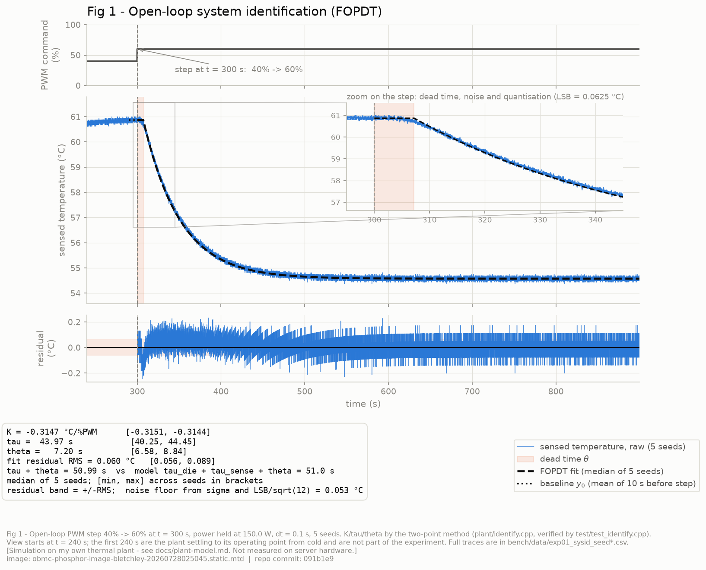
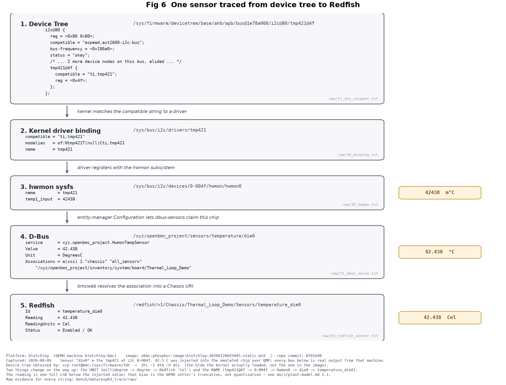

# OpenBMC Closed-Loop Thermal Control Testbed

在 QEMU ASPEED AST2600 上，用上游 `phosphor-pid-control` 建立一條可量測、
可重現的熱控閉環，並**量化上游既有抗飽和機制（anti-windup）的實際效果**。

> 🚧 進行中(2026-07 起)。目前進度:**Gate 0~2 完成、Gate 3 進度 3/7**——
> 一行指令從**模擬硬體層**(QEMU 的 tmp421 晶片模型)改溫度,
> 經 kernel driver → hwmon sysfs → `dbus-sensors` → D-Bus,
> **`busctl`、`swampd` 的 PID 軌跡、Redfish 三個地方同時變**。
> 每一段的行程數與 IPC 次數都量過,見
> [`docs/architecture.md`](docs/architecture.md) 的〈一個溫度值的旅程〉。

## 為什麼做這個

（W10 補完。）

## 目標平台

主線 **`bletchley`**（QEMU `bletchley-bmc`），備援 **`catalina`**（QEMU `catalina-bmc`）。
兩台都是 AST2600 / Cortex-A7。

此選擇來自 `harness/qemu/platform_matrix.sh` 對 19 個 Jenkins target 的實測掃描
（見 [`docs/platform-matrix.md`](docs/platform-matrix.md)）——依據是三個條件的交集：

```
{ Jenkins 有出映像 } ∩ { QEMU 有 machine model } ∩ { 映像含 phosphor-pid-control }
```

`romulus` 與 `gb200nvl-obmc` 明確排除：manifest 顯示它們**沒有**
`phosphor-pid-control`。這一步是查證，不是試錯。

## 架構

見 `docs/architecture.md`。

## 現況

- [x] Gate 0　環境就緒　　　　　　　← [env-baseline.md](docs/env-baseline.md)
- [x] Gate 1　端到端可觀測
  - [x] 一行指令把溫度從 40 改成 80　　← `tools/set_die_temp.py`(QMP → tmp421)
  - [x] `busctl` 看得到 `Value` 變了,且 `swampd` 收得到
        (`pidcore.die0` 的 `input` 欄跟著變,`error = setpoint − input`)
  - [x] Redfish 看到同一變化
        ← `/redfish/v1/Chassis/Thermal_Loop_Demo/Sensors/temperature_die0`
  - [x] 畫得出從指令到 Redfish JSON 經過哪幾個行程、幾次 IPC
        ← [architecture.md](docs/architecture.md)。**實測:一次 Redfish GET =
        3 個 method call(認證 / ObjectMapper / GetAll)+ 3 個回覆,牽涉 5 個行程**
  - [x] 知道**為什麼**有些感測器出現在 Redfish、有些沒有
        ← [redfish-notes.md](docs/redfish-notes.md)。**同機對照組:**
        我這顆有 `chassis`/`all_sensors` association → 看得到;
        上游的 `nvme1`~`nvme6` 沒有 → 看不到

  > ⚠️ **誠實標註(兩件事):**
  > 1. **溫度來自 QEMU 的 tmp421 裝置模型,不是真實硬體。** 它證明的是
  >    「從 i2c 晶片到 Redfish 的整條軟體路徑是通的、每一層讀到什麼值」。
  >    這顆晶片物理上是板上溫感,叫它 `die0` 是我的建模選擇。
  > 2. **這台 QEMU 沒有任何風扇硬體**(`/sys/class/pwm/` 是空的,
  >    D-Bus 上沒有 `fan_tach`)。設定裡的 `fan0` 讀寫的是 `/tmp/sys/` 底下的
  >    **普通檔案**,證明的是「swampd 的寫出路徑被執行了、值是多少」,
  >    **不是「風扇真的轉了」**。理由與做法見
  >    [`config/swampd/README.md`](config/swampd/README.md)。
  >
  > 📌 **計畫原訂的 route (b)(`dbus-sensors` 的 `ExternalSensor`)在這個映像上
  > 不存在** —— `meta-facebook` 的 bbappend 明文 `PACKAGECONFIG:remove`。
  > 根因與替代路線見 [`config/entity-manager/README.md`](config/entity-manager/README.md)。

- [x] Gate 2　被控對象 + 跨層追蹤　　← **6/6(W5 收關)**
  - [x] **熱系統模型**(C++,一階熱容 + 對流熱阻 + 風扇慣性 + 傳輸死區 + 感測遲滯)
        ← [`plant/`](plant/)、[`docs/plant-model.md`](docs/plant-model.md)
  - [x] meson + gtest 骨架,與上游 `phosphor-pid-control` 同一套
  - [x] 我說得出每個參數的物理意義與量級理由(含哪些是【判】、哪些是【驗】)
  - [x] **七個 L0 gtest 全綠**(能量守恆、單調性、死區、時間常數、決定性、**飽和條件**)
        —— 外加五個識別測試,共 12 個
  - [x] **開環階躍跑得出 K、τ、θ**(FOPDT 兩點法,5 個 seed)→ **Fig 1**,見下
  - [x] **Fig 6**:dts → i2c bus → hwmon → D-Bus → Redfish 的完整對照,見下
  - [x] 我能指著 dts 的一行說「這一行決定了 Redfish 上這個 URI」
        ← [devicetree-to-dbus.md](docs/devicetree-to-dbus.md)

### ★ Fig 1 —— 開環系統識別(第一張證據圖)



PWM 從 40 % 階躍到 60 %,功耗固定 150 W,5 個不同雜訊 seed。
用兩點法(28.3 % / 63.2 %)量到
**K = −0.3147 °C/%PWM、τ = 43.97 s、θ = 7.20 s**(中位數;範圍見圖上的方括號)。

**兩個交叉驗證 —— 這才是這張圖的重點:**

| 檢驗 | 結果 |
|---|---|
| **`τ + θ` 守恆**。FOPDT 只有一個時間常數,模型有兩個一階環節,感測遲滯會被擠進 θ | 實測 **50.99 s**;模型設定的 `τ_die + τ_sense + θ` = **51.0 s**,差 **0.02 %** |
| **擬合殘差落在雜訊底上**。`σ = 0.05` 與量化 `LSB/√12 = 0.018` 獨立,合成 0.053 °C | 實測殘差 **0.056~0.060 °C** → 一階形狀沒有留下系統性偏差 |

> 📌 **這是模擬結果**,在我自己寫的熱模型上
> (見 [`docs/plant-model.md`](docs/plant-model.md)),**不是在伺服器硬體上量的**。
> 原始 CSV、七欄實驗協定、已知限制,全部在
> [`docs/measurement.md`](docs/measurement.md) 的 exp01。
>
> ```bash
> python bench/exp01_sysid.py --out bench/data   # 跑 5 個 seed,原始 CSV 進 git
> python bench/plot.py --fig 1                   # 從那些 CSV 產生上面這張圖
> ```

### ★ Fig 6 —— 一顆感測器從 device tree 到 Redfish



**圖上每一格都是這台機器的真實輸出**,每一格右下角標的是它來自哪一條指令的
stdout(全部在 [`bench/data/exp03_trace/raw/`](bench/data/exp03_trace/))。
device tree 取的是 `/sys/firmware/fdt` ——**kernel 實際載入的那一份**,
不是映像裡的 `.dtb`。

```bash
./tools/trace_sensor.sh      # 擷取五層的原始輸出,產生 layers.json
python bench/plot_fig6.py    # 從 layers.json 畫出上面這張圖
```

**這張圖的兩個重點:**

| | |
|---|---|
| **單位換了三次** | `42438`(毫度 C)→ `42.438`(度 C)→ Redfish 的 `Cel` |
| **名字換了四次** | `tmp421@4f` → `0-004f` → `hwmon0` → `die0` → `temperature_die0` |

沒有任何一層看得到下一層的名字,**每一層的對應關係都是另外一份設定決定的**:
`compatible` 綁 driver、entity-manager 的 Configuration 讓 `dbus-sensors` 認領、
association 讓 bmcweb 掛進 Chassis。

> **★ 順手量到的東西:** 一顆感測器要出現在 D-Bus 上,
> 「**硬體在**」與「**設定在**」是兩個獨立的必要條件,
> 而這台機器同時提供了兩種失敗:
> dts 宣告了 **10 顆** tmp421、kernel 全部綁上,但只有 `die0` 有 entity-manager
> 設定(有硬體沒設定);而 `FRONT_PANEL_TEMP` 有設定,QEMU 卻沒模擬那顆 SI7020
> (有設定沒硬體)。細節見
> [`docs/devicetree-to-dbus.md`](docs/devicetree-to-dbus.md) 第 4 節。

> 📌 **誠實標註:** 這是「讀 ＋ 對照」。**我沒有寫過 kernel driver,
> 也沒有改過 device tree 重新編譯驗證。** 底下那顆晶片是 QEMU 模擬的,
> 從 i2c driver 往上才是真的軟體。

### Gate 3 起步:我自己的 PI,以及與上游的逐步比對

[`controller/pi.cpp`](controller/pi.cpp) 是一版 C++ PI,含四種抗飽和策略
(無處理 / 積分箝位 / 條件積分 / 標準回算),外加第五個模式
`UpstreamParity` —— **逐行複製上游 `ec::pid()` 的行為**。

[`test/test_parity_upstream.cpp`](test/test_parity_upstream.cpp) 把上游
`pid/ec/pid.cpp` **真的編進這個測試**(meson wrap 釘住 commit `c5e59550d3`,
與這台 BMC 映像同一版),逐步比對到 `1e-12`。

掃的是 **setpoint × slewPos × slewNeg × kd × ffGain × ts 六個參數,共 144 組**,
每組跑一整條約 90 步的輸入序列。

> ⚠️ **「144 組」不等於「參數空間掃過了」,不要被聽成那個意思。**
> `kp`、`ki`、`outLim`、`integralLimit`、`feedFwdOffset` 與輸入序列本身都是**固定**的。
> 選這六個是因為它們各自對應一條**會分岔的程式路徑**(slew 的兩個方向、
> D 項、前饋、以及每一處乘除 `ts` 的算術),不是因為它們比較多。

**比對的是序列不是單點**,而且輸入一定要「爬升 → 飽和 → 解除」——
那正是 anti-windup 的作用區間,**不製造飽和的測試等於沒測**
(這件事本身也有一個測試守著:`TheBatteryActuallySaturatesBothLimits`)。

**★ 有一個組合是刻意讓它分歧的,而且我沒有改我的實作去配合上游:**
slew rate limit 有設定、而且前饋增益不為零時,上游把積分回算成
`output − proportionalTerm`,**沒有扣掉前饋那一份**。實測第 **13** 個時間步
開始分岔,輸出最大差 **4.75**、積分最大差 **62.5**;把前饋設成 0 則完全一致
—— 那條控制組證明分歧確實來自前饋項。

> 我不確定這是刻意的設計還是我理解錯,所以**寫成一個獨立測試留在 repo 裡,
> 打算去 Discord 問**,而不是斷言上游有問題。見
> [`docs/upstream.md`](docs/upstream.md) 的〈未提交的候選〉。

### 證據怎麼被守住

```bash
meson test -C build          # 4 支測試執行檔（plant / identify / pi / parity_upstream）
./tools/mutation_check.sh    # 故意植入 21 個錯誤，每一個都必須讓某個測試變紅
```

**第二行才是重點。** 「測試是綠的」只證明目前沒有斷言被觸發,
**不證明「東西壞掉的話斷言會叫」**。`mutation_check.sh` 一次植入一個
真的可能寫錯的錯誤(對流符號反、死區佇列拿掉、亂數改成全域共用、
把 `rthMin` 調小讓飽和條件悄悄消失……),重編、重跑、記錄哪些測試變紅,
**有任何一個活下來就離開碼 1**。

實測 **21 個全被抓到**,其中數個**各自只有一個測試抓得到** ——
那些測試是它們各自性質的唯一防線,而這份對照證明了它們守得住。

> ★ **設計 mutation 的過程,兩次抓出測試自己的漏洞。**
>
> **第一次:** 有一個植入的錯誤是「上游的積分回算多扣了前饋」。我原本的比對只掃
> `ffGain = 0`,所以那個錯**活得下來**。補上 `ffGain ∈ {0, 0.4}`
> (組合數 36 → 72)之後才抓得到。
>
> **第二次(更嚴重):** 我的**每一個**測試的取樣週期 `ts` 都是 `1.0`。
> 乘 1 跟不乘看起來一樣,所以**所有乘上或除以 `ts` 的算術從來沒有被測到**——
> 植入四個「忘了乘 ts」的錯,四個全部活下來,整套測試依然全綠。
> 而這不是理論問題:這個 repo 自己的 `config.baseline.json` 裡,
> 風扇 PID 的 `samplePeriod` 就是 **0.1**。
> **驗過的那個切面,正好是我實際上不會用到的那一個。**
> 補上 `ts ∈ {1.0, 0.1}` 之後組合數 72 → 144。
>
> 補完之後又發現我補的測試自己只驗了一半 —— 只測 `slewPos`、沒測 `slewNeg`,
> 於是「slewNeg 忘了乘 ts」仍然活著。**一個只驗一半的測試,看起來跟驗完整的一樣綠。**
>
> 這三個洞都**不是跑測試發現的**(跑幾次都綠),是「**我要植入哪一種錯**」逼出來的。

- [ ] Gate 3　控制器與量測　　　　← **3/7(W5 起步)**
  - [x] 我自己的 PI(C++,四種抗飽和 + 一個上游相容模式)← [`controller/`](controller/)
  - [x] 與上游 `ec::pid()` 的 gtest parity 測試(六個參數 144 組,`1e-12`)
  - [x] **符號檢查實驗**(兩點法;`temp` 型別要用負係數)
        ← [`tools/sign_check.sh`](tools/sign_check.sh)、`bench/data/exp02_signcheck/`
  - [ ] λ 整定 → **Fig 2**　← W6
  - [ ] **anti-windup A/B(L1 + L2)**　← W7,核心證據
  - [ ] slew 掃描(含風扇功耗)　← W8
  - [ ] 量出 swampd 的兩個時間常數,驗證串級架構　← W6
- [ ] Gate 4　失效安全
- [ ] Gate 5　官方測試套件
- [ ] Gate 6　Upstream
- [ ] Gate 7　交付與敘事

## 授權

Apache-2.0（與 OpenBMC 上游一致）。
