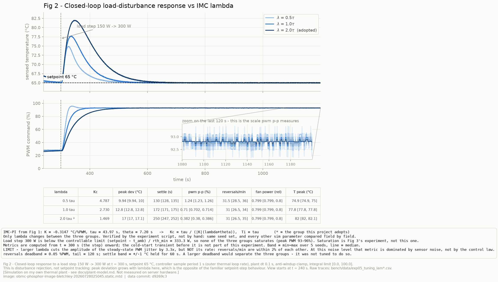
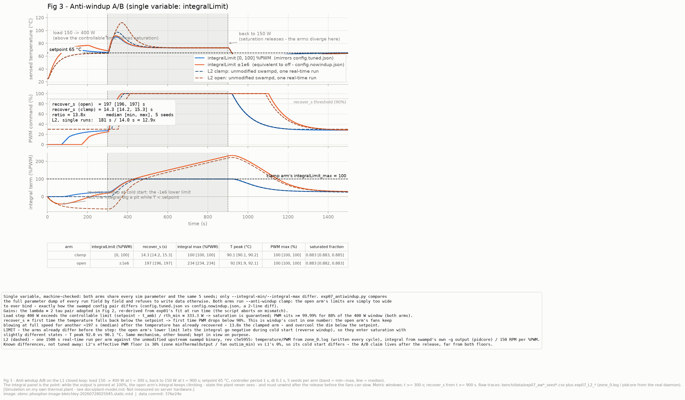

# OpenBMC Closed-Loop Thermal Control Testbed

在 QEMU ASPEED AST2600 上，用上游 `phosphor-pid-control` 建立一條可量測、
可重現的熱控閉環，並**量化上游既有抗飽和機制（anti-windup）的實際效果**。

> 🚧 進行中(2026-07 起)。目前進度:**Gate 0~2 完成、Gate 3 進度 6/7**。
>
> **端到端可觀測:** 一行指令從**模擬硬體層**(QEMU 的 tmp421 晶片模型)改溫度,
> 經 kernel driver → hwmon sysfs → `dbus-sensors` → D-Bus,
> **`busctl`、`swampd` 的 PID 軌跡、Redfish 三個地方同時變**。
> 每一段的行程數與 IPC 次數都量過,見
> [`docs/architecture.md`](docs/architecture.md) 的〈一個溫度值的旅程〉。
>
> **閉環已經跑起來:** PI 係數由開環系統識別的 `K/τ/θ` 用 IMC 法算出
> ——**不是試出來的**,見下方 Fig 2。
> 而 swampd 的兩個迴路週期是量到的、不是引用的
> (內圈 **100 ms** / 外圈 **1000 ms**,見 [`docs/cascade.md`](docs/cascade.md))。

## 為什麼做這個

（W10 補完。）

## 目標平台

主線 **`bletchley`**（QEMU `bletchley-bmc`），備援 **`catalina`**（QEMU `catalina-bmc`）。
兩台都是 AST2600 / Cortex-A7。

此選擇來自 `harness/qemu/platform_matrix.sh` 對 19 個 Jenkins target 的實測掃描
（見 [`docs/platform-matrix.md`](docs/platform-matrix.md)）——依據是三個條件的交集：

```
{ Jenkins 有出映像 } ∩ { QEMU 有 machine model } ∩ { 映像含 phosphor-pid-control }
```

`romulus` 與 `gb200nvl-obmc` 明確排除：manifest 顯示它們**沒有**
`phosphor-pid-control`。這一步是查證，不是試錯。

## 架構

見 `docs/architecture.md`。

## 現況

- [x] Gate 0　環境就緒　　　　　　　← [env-baseline.md](docs/env-baseline.md)
- [x] Gate 1　端到端可觀測
  - [x] 一行指令把溫度從 40 改成 80　　← `tools/set_die_temp.py`(QMP → tmp421)
  - [x] `busctl` 看得到 `Value` 變了,且 `swampd` 收得到
        (`pidcore.die0` 的 `input` 欄跟著變,`error = setpoint − input`)
  - [x] Redfish 看到同一變化
        ← `/redfish/v1/Chassis/Thermal_Loop_Demo/Sensors/temperature_die0`
  - [x] 畫得出從指令到 Redfish JSON 經過哪幾個行程、幾次 IPC
        ← [architecture.md](docs/architecture.md)。**實測:一次 Redfish GET =
        3 個 method call(認證 / ObjectMapper / GetAll)+ 3 個回覆,牽涉 5 個行程**
  - [x] 知道**為什麼**有些感測器出現在 Redfish、有些沒有
        ← [redfish-notes.md](docs/redfish-notes.md)。**同機對照組:**
        我這顆有 `chassis`/`all_sensors` association → 看得到;
        上游的 `nvme1`~`nvme6` 沒有 → 看不到

  > ⚠️ **誠實標註(兩件事):**
  > 1. **溫度來自 QEMU 的 tmp421 裝置模型,不是真實硬體。** 它證明的是
  >    「從 i2c 晶片到 Redfish 的整條軟體路徑是通的、每一層讀到什麼值」。
  >    這顆晶片物理上是板上溫感,叫它 `die0` 是我的建模選擇。
  > 2. **這台 QEMU 沒有任何風扇硬體**(`/sys/class/pwm/` 是空的,
  >    D-Bus 上沒有 `fan_tach`)。設定裡的 `fan0` 讀寫的是 `/tmp/sys/` 底下的
  >    **普通檔案**,證明的是「swampd 的寫出路徑被執行了、值是多少」,
  >    **不是「風扇真的轉了」**。理由與做法見
  >    [`config/swampd/README.md`](config/swampd/README.md)。
  >
  > 📌 **計畫原訂的 route (b)(`dbus-sensors` 的 `ExternalSensor`)在這個映像上
  > 不存在** —— `meta-facebook` 的 bbappend 明文 `PACKAGECONFIG:remove`。
  > 根因與替代路線見 [`config/entity-manager/README.md`](config/entity-manager/README.md)。

- [x] Gate 2　被控對象 + 跨層追蹤　　← **6/6(W5 收關)**
  - [x] **熱系統模型**(C++,一階熱容 + 對流熱阻 + 風扇慣性 + 傳輸死區 + 感測遲滯)
        ← [`plant/`](plant/)、[`docs/plant-model.md`](docs/plant-model.md)
  - [x] meson + gtest 骨架,與上游 `phosphor-pid-control` 同一套
  - [x] 我說得出每個參數的物理意義與量級理由(含哪些是【判】、哪些是【驗】)
  - [x] **七個 L0 gtest 全綠**(能量守恆、單調性、死區、時間常數、決定性、**飽和條件**)
        —— 外加識別測試(現為 6 個)
  - [x] **開環階躍跑得出 K、τ、θ**(FOPDT 兩點法,5 個 seed)→ **Fig 1**,見下
  - [x] **Fig 6**:dts → i2c bus → hwmon → D-Bus → Redfish 的完整對照,見下
  - [x] 我能指著 dts 的一行說「這一行決定了 Redfish 上這個 URI」
        ← [devicetree-to-dbus.md](docs/devicetree-to-dbus.md)

### ★ Fig 1 —— 開環系統識別(第一張證據圖)


PWM 從 40 % 階躍到 60 %,功耗固定 150 W,5 個不同雜訊 seed。
用兩點法(28.3 % / 63.2 %)量到
**K = −0.3147 °C/%PWM、τ = 43.97 s、θ = 7.20 s**(中位數;範圍見圖上的方括號)。

**兩個交叉驗證 —— 這才是這張圖的重點:**

| 檢驗 | 結果 |
|---|---|
| **`τ + θ` 守恆**。FOPDT 只有一個時間常數,模型有兩個一階環節,感測遲滯會被擠進 θ | 實測 **50.99 s**;模型設定的 `τ_die + τ_sense + θ` = **51.0 s**,差 **0.02 %** |
| **擬合殘差落在雜訊底上**。`σ = 0.05` 與量化 `LSB/√12 = 0.018` 獨立,合成 0.053 °C | 實測殘差 **0.056~0.060 °C** → 一階形狀沒有留下系統性偏差 |

> 📌 **這是模擬結果**,在我自己寫的熱模型上
> (見 [`docs/plant-model.md`](docs/plant-model.md)),**不是在伺服器硬體上量的**。
> 原始 CSV、七欄實驗協定、已知限制,全部在
> [`docs/measurement.md`](docs/measurement.md) 的 exp01。
>
> ```bash
> python bench/exp01_sysid.py --out bench/data   # 跑 5 個 seed,原始 CSV 進 git
> python bench/plot.py --fig 1                   # 從那些 CSV 產生上面這張圖
> ```

### ★ Fig 6 —— 一顆感測器從 device tree 到 Redfish


**圖上每一格都是這台機器的真實輸出**,每一格右下角標的是它來自哪一條指令的
stdout(全部在 [`bench/data/exp03_trace/raw/`](bench/data/exp03_trace/))。
device tree 取的是 `/sys/firmware/fdt` ——**kernel 實際載入的那一份**,
不是映像裡的 `.dtb`。

```bash
./tools/trace_sensor.sh      # 擷取五層的原始輸出,產生 layers.json
python bench/plot_fig6.py    # 從 layers.json 畫出上面這張圖
```

**這張圖的兩個重點:**

| | |
|---|---|
| **單位換了三次** | `42438`(毫度 C)→ `42.438`(度 C)→ Redfish 的 `Cel` |
| **名字換了四次** | `tmp421@4f` → `0-004f` → `hwmon0` → `die0` → `temperature_die0` |

沒有任何一層看得到下一層的名字,**每一層的對應關係都是另外一份設定決定的**:
`compatible` 綁 driver、entity-manager 的 Configuration 讓 `dbus-sensors` 認領、
association 讓 bmcweb 掛進 Chassis。

> **★ 順手量到的東西:** 在 **`dbus-sensors` 這一條路上**,
> 「**硬體在**」與「**設定在**」是兩個獨立的必要條件,
> 而這台機器同時提供了兩種失敗:
> dts 宣告了 **10 顆** tmp421、kernel 全部綁上,但只有 `die0` 有 entity-manager
> 設定(有硬體沒設定);而 `FRONT_PANEL_TEMP` 有設定,QEMU 卻沒模擬那顆 SI7020
> (有設定沒硬體)。
>
> ⚠️ **但「沒有 EM Configuration 就不會出現在 D-Bus 上」是過度推廣,不成立。**
> 同一台機器上有 **8 顆**溫度感測器、**3 個**不同的擁有者,
> 而 entity-manager 上只有 **2 個** Configuration:
> `nvme1`~`nvme6` 屬 `xyz.openbmc_project.nvme.manager`(讀 `/etc/nvme/nvme_config.json`)、
> `Virtual_Inlet_Temp` 屬 `xyz.openbmc_project.VirtualSensor`(讀它自己那套 JSON)。
> **EM Configuration 是 `dbus-sensors` 那一族的閘門,不是普遍條件。**
> 所以 debug 的第一步是先問「這顆是誰在 own」,再去看對應的設定檔。
> 細節與實測見
> [`docs/devicetree-to-dbus.md`](docs/devicetree-to-dbus.md) 第 4 節與 §4.1。

> 📌 **誠實標註:** 這是「讀 ＋ 對照」。**我沒有寫過 kernel driver,
> 也沒有改過 device tree 重新編譯驗證。** 底下那顆晶片是 QEMU 模擬的,
> 從 i2c driver 往上才是真的軟體。

### Gate 3 起步:我自己的 PI,以及與上游的逐步比對

[`controller/pi.cpp`](controller/pi.cpp) 是一版 C++ PI,含四種抗飽和策略
(無處理 / 積分箝位 / 條件積分 / **標準回算,含可調的追蹤時間常數 Tt**),
外加第五個模式 `UpstreamParity` —— **逐行複製上游 `ec::pid()` 的行為**。

### ★ 它是「一個能收斂的控制器」嗎 —— 這是另一個問題

parity 測試證明的是「**我的算術跟上游一樣**」。
**那不等於「這是個能收斂的控制器」** —— 兩個實作可以逐位元一致地一起錯。

[`test/test_closed_loop.cpp`](test/test_closed_loop.cpp) 把 `controller/`
與 `plant/` 真的接起來跑,補的是那個缺口:

| 測試 | 斷言 |
|---|---|
| `ConvergesToSetpointWithNegativeGain` | 穩態誤差 < **3 個雜訊底**(容差由 σ 與 LSB 推導,不是調出來的),而且輸出落在可調範圍內 —— 不是靠撞邊界停住的 |
| `WrongSignLatchesAtALimitInsteadOfControlling` | **符號檢查(exp02)的程式碼版本** |
| `AntiWindupRecoversFasterThanNone` | 製造飽和再解除,`None` 卡在上限的時間 > `Clamp` / `BackCalculation` |
| `SameSeedGivesTheSameTrajectory` | 同 seed 逐點相同 —— 沒有它,上面三條的「差異」可能只是亂數 |

> **★ 這支測試抓到的第一件事,是我自己講錯的一段話。**
> 我原本以為「係數符號錯 = 風扇停掉 = 溫度飆高」。
> 實測是**風扇衝到 100 % 並鎖死,溫度停在 43 °C —— 比目標低 22 度**。
> 根因:符號反了等於把負回饋變成**正回饋**,而正回饋會往
> **起始誤差的那一邊**鎖死 —— 落到哪一個極限**取決於初始條件**。
> 而且這個版本的症狀更難發現:「風扇 100 %、溫度 43 °C」在監控畫面上
> **看起來完全健康**,只是永遠全速在燒電。
>
> 這條測試在 mutation 表裡不是任何一個植入錯誤的唯一捕手 ——
> 它抓到的是**敘事裡的錯**,而那種錯沒有任何單行 mutation 表達得出來。

[`test/test_parity_upstream.cpp`](test/test_parity_upstream.cpp) 把上游
`pid/ec/pid.cpp` **真的編進這個測試**(meson wrap 釘住 commit `c5e59550d3`,
與這台 BMC 映像同一版),逐步比對到 `1e-12`。

掃的是 **setpoint × slewPos × slewNeg × kd × ffGain × ts 六個參數,共 144 組**,
每組跑一整條約 90 步的輸入序列。

> ⚠️ **「144 組」不等於「參數空間掃過了」,不要被聽成那個意思。**
> `kp`、`ki`、`outLim`、`integralLimit`、`feedFwdOffset` 與輸入序列本身都是**固定**的。
> 選這六個是因為它們各自對應一條**會分岔的程式路徑**(slew 的兩個方向、
> D 項、前饋、以及每一處乘除 `ts` 的算術),不是因為它們比較多。

**比對的是序列不是單點**,而且輸入一定要「爬升 → 飽和 → 解除」——
那正是 anti-windup 的作用區間,**不製造飽和的測試等於沒測**
(這件事本身也有一個測試守著:`TheBatteryActuallySaturatesBothLimits`)。

**★ 有一個組合是刻意讓它分歧的,而且我沒有改我的實作去配合上游:**
slew rate limit 有設定、而且前饋增益不為零時,上游把積分回算成
`output − proportionalTerm`,**沒有扣掉前饋那一份**。實測第 **13** 個時間步
開始分岔,輸出最大差 **4.75**、積分最大差 **62.5**;把前饋設成 0 則完全一致
—— 那條控制組證明分歧確實來自前饋項。

> 我不確定這是刻意的設計還是我理解錯,所以**寫成一個獨立測試留在 repo 裡,
> 打算去 Discord 問**,而不是斷言上游有問題。見
> [`docs/upstream.md`](docs/upstream.md) 的〈未提交的候選〉。

### ★ Fig 2 —— 閉環:PI 係數是算出來的,不是試出來的



**係數的來歷是一條可以一節一節走完的鏈**,沒有任何一步是「試出來的」:

```
開環階躍 CSV(Fig 1)
  → K = −0.3147 °C/%PWM,  τ = 43.97 s,  θ = 7.20 s
  → IMC-PI:  Kc = τ / (|K|(λ+θ)),  Ti = τ          ← bench/tune.py
  → λ 是唯一旋鈕,物理意義是「我要的閉環時間常數」
```

**為什麼不是 Ziegler–Nichols:** ZN 的目標是四分之一衰減(約 25 % 超調),
它為速度設計。風扇迴路的成本函數相反 —— 熱時間常數數十秒,快沒有價值,
**但轉速一震盪使用者立刻聽得到**。而且實務上也做不了:ZN 要把系統推到臨界振盪,
真實迴路有 slew limit 與輸出飽和,量不到乾淨的 `Ku`、`Tu`。

| λ | Kc | 峰值偏差 (°C) | 穩定 (s) | PWM 峰對峰 (%) | 反轉/分 | 相對風扇功耗 |
|---|---|---|---|---|---|---|
| 0.5τ | 4.787 | **9.94** | 130 | **1.245** | 31.5 | 0.799 |
| 1.0τ | 2.730 | 12.75 | 172 | 0.710 | 31.0 | 0.799 |
| **2.0τ**(採用) | 1.469 | **17.00** | 250 | **0.382** | 31.0 | 0.799 |

**取捨是量出來的:** λ 從 0.5τ 放大到 2.0τ,穩態 PWM 抖動的**幅度降 3.26 倍**,
代價是**峰值溫度偏差高 7.06 °C**。這兩個數字要一起講,只講前一個是行銷。

> ⚠️ 這是**負載擾動**(功耗跳變),不是 setpoint 追蹤。
> 兩者對增益的反應方向相反 —— setpoint 階躍時高增益會衝過頭,
> 擾動時高增益壓得住偏差。所以這裡的「峰值偏差」隨 λ 變大而變大,
> 那不是 bug,是實驗設計的直接後果。

> **★ 這張圖同時登記了兩個「沒有效果」的結果,那是刻意的:**
>
> 1. **`reversals_per_min` 三組幾乎相同**(31.5 / 31.0 / 31.0)。
>    λ 放大降低的是抖動的**幅度**,不是**頻率** —— 在這個雜訊水準下,
>    這個指標量到的是感測雜訊的時間結構,不是控制律。
>    **把 deadband 調大就能讓三組分開。沒有調。**
>    那樣得到的差異是我選出來的,不是量到的。
> 2. **`fan_power_rel` 三組相同(差 0.016 %)**,而且物理上必然:
>    穩態溫度被 setpoint 釘住、負載固定 → 熱阻唯一 → 轉速唯一,**與控制器無關**。
>    λ 的代價是峰值溫度,不是功耗。

> 📌 **這是模擬結果**(見 [`docs/plant-model.md`](docs/plant-model.md))。
> 負載階躍選 300 W 而不是更大的值,是**算出來的**:
> 這個迴路的可控功率上限是 `(setpoint − t_amb) / rth_min = 333.3 W`,
> 超過它風扇滿速也壓不到 setpoint。實測 400 W 時三組全部貼在 100 % PWM、
> 穩定時間全是 `NaN`、三條線重疊 —— **那張圖什麼都證明不了**。
> 飽和是 anti-windup 實驗要的條件,不是這一張。
>
> ```bash
> python bench/exp05_tuning.py --out bench/data   # 3 λ × 5 seed = 15 份 CSV
> python bench/plot.py --fig 2                    # 從那些 CSV 產生上面這張圖
> ```

### ★ swampd 是一個 PID 還是兩個 —— 兩個,而且週期是量到的

完整紀錄見 [`docs/cascade.md`](docs/cascade.md)。

| 迴路 | 我量到的(中位數) | p05 ~ p95 | n | 上游常數 |
|---|---|---|---|---|
| 內圈(風扇 PID) | **100.0 ms** | 95 ~ 105 | 819 | `cycleIntervalTimeMS = 100` |
| 外圈(熱 PID) | **1000.0 ms** | 994 ~ 1008 | 81 | `updateThermalsTimeMS = 1000` |

**★ 量之前先發現量測方法是錯的,這才是這一節的重點。**

原本要用 `pidcore.*` 的時間戳來量,實測相鄰間隔是 **60013 ~ 67569 ms** ——
不是 1000 ms,差 60 倍。讀上游 `pid/ec/logging.cpp` 才知道:

```cpp
static constexpr int logThrottle = 60 * 1000;
// LogContext():「內容變了」或「距上次超過 logThrottle」才寫一筆
```

**`pidcore.*` 不是等間隔取樣的 log。** 迴路靜態時每一筆的內容相同,
只剩節流在寫 —— 量到的是 log 的節流間隔,與迴路週期無關。
`zone_0.log` 由 `DbusPidZone::writeLog()` 直寫、**沒有節流**,週期要從它量:
行間隔給內圈,`setpt` 欄變化的間隔給外圈。
**同一個 daemon 的兩份 log,兩種寫入策略。**

> ⚠️ 這件事對下一步有直接後果:anti-windup 的積分軌跡要從 `pidcore.*` 畫,
> 而**「積分不再變化」的那一段正是 anti-windup 生效之後的那一段** ——
> 不知道節流就畫,最該看清楚的地方會被壓縮成幾個點,曲線卻仍然像等間隔的。

> ⚠️ **報中位數不報平均。** 同一批樣本的平均是 118.8 / 1191.2 ms,
> 被 QEMU 的排程抖動(單次最大 7.8 s)拉高約 19 %。
> 平均描述的是這個測試床,不是 swampd。

**★ 交叉驗證:係數從 Fig 1 一路算到 BMC 上的一行 log。**
把 λ = 2τ 的係數換算成外圈的 RPM 量綱(× 150,因為模擬輸出 PWM 百分比、
swampd 外圈輸出 RPM setpoint)填進去,BMC 上 `pidcore.die0` 的實測:

| 項 | 手算 | BMC 實測 |
|---|---|---|
| P 項 | `−220.279 × (−19.938)` = **4391.92** | **4391.92** |
| 每步積分增量 | `−5.00952 × (−19.938) × 1.0` = **99.880** | **99.8798** |

> 這條鏈證明的不是「我算得對」,是**「BMC 上跑的那個數字,指得回我自己量的那張圖」**。

### 證據怎麼被守住

```bash
meson test -C build          # 6 個測試（5 支 gtest 執行檔 + pytest）
                             # = 32 個 gtest case + 82 個 pytest case
./tools/mutation_check.sh    # 故意植入 41 個錯誤，每一個都必須讓某個測試變紅
```

**第二行才是重點。** 「測試是綠的」只證明目前沒有斷言被觸發,
**不證明「東西壞掉的話斷言會叫」**。`mutation_check.sh` 一次植入一個
真的可能寫錯的錯誤(對流符號反、死區佇列拿掉、亂數改成全域共用、
把 `rthMin` 調小讓飽和條件悄悄消失……),重編、重跑、記錄哪些測試變紅,
**有任何一個活下來就離開碼 1**。

實測 **41 個全被抓到**,其中數個**各自只有一個測試抓得到** ——
那些測試是它們各自性質的唯一防線,而這份對照證明了它們守得住。

> ★ **有兩個植入的錯誤,植的是「另一種合理的寫法」而不是「明顯的 bug」。**
> `settle_s` 用列數框視窗、`reversals_per_min` 用要求的視窗長度當分母 ——
> 兩種寫法都跑得動、都給得出像樣的數字,而且**在等間隔取樣的資料上完全正確**。
> 它們只在資料不等間隔或比視窗短的時候才錯,而那正是從 BMC 收回來的資料。
> **把它們植進 mutation 表,是為了讓「我為什麼不那樣寫」變成一件機器會檢查的事,
> 而不是一句可以事後補上的說法。**

> ★ **有一個植入的錯誤是「把 QEMU setter 的 `−128` 拿掉」,而抓到它的是
> `bench/data/exp04_injection/` 那批實測 CSV。**
> 那條 mutation 的意義不只是「預測式有測試」——它同時證明了
> **那些 CSV 是有在承重的證據,不是擺著好看的附件**。
> 用我自己手寫的期望值去驗預測式,只能證明我前後一致;
> 用機器上量到的資料去驗,才證明我對那條路徑的理解是對的。

> ★ **設計 mutation 的過程,兩次抓出測試自己的漏洞。**
>
> **第一次:** 有一個植入的錯誤是「上游的積分回算多扣了前饋」。我原本的比對只掃
> `ffGain = 0`,所以那個錯**活得下來**。補上 `ffGain ∈ {0, 0.4}`
> (組合數 36 → 72)之後才抓得到。
>
> **第二次(更嚴重):** 我的**每一個**測試的取樣週期 `ts` 都是 `1.0`。
> 乘 1 跟不乘看起來一樣,所以**所有乘上或除以 `ts` 的算術從來沒有被測到**——
> 植入四個「忘了乘 ts」的錯,四個全部活下來,整套測試依然全綠。
> 而這不是理論問題:這個 repo 自己的 `config.baseline.json` 裡,
> 風扇 PID 的 `samplePeriod` 就是 **0.1**。
> **驗過的那個切面,正好是我實際上不會用到的那一個。**
> 補上 `ts ∈ {1.0, 0.1}` 之後組合數 72 → 144。
>
> 補完之後又發現我補的測試自己只驗了一半 —— 只測 `slewPos`、沒測 `slewNeg`,
> 於是「slewNeg 忘了乘 ts」仍然活著。**一個只驗一半的測試,看起來跟驗完整的一樣綠。**
>
> 這三個洞都**不是跑測試發現的**(跑幾次都綠),是「**我要植入哪一種錯**」逼出來的。

### ★★ Fig 3 —— anti-windup 單變因 A/B(核心證據)



負載 150 → 400 W(t=300 s;**刻意超過可控上限 (65−25)/0.12 = 333.3 W**,
飽和必然發生)→ 降回 150 W(t=900 s,飽和解除)。實線+帶狀 = L1,
5 個共用 seed;**虛線 = L2:未修改的上游 swampd 二進位**(與 BMC 映像
同版 `c5e5955`)透過私有 D-Bus 控制同一份 plant,單趟即時執行。

| | L1(5 seed 配對中位)| L2(單趟,真 swampd)|
|---|---|---|
| 恢復時間 `recover_s`(無箝位)| 197.2 s | 181.0 s |
| 恢復時間 `recover_s`(有箝位)| **14.3 s** | **14.0 s** |
| **比值** | **13.7×** [12.8, 13.9] | **12.9×** —— 落在 L1 範圍內 |
| 積分峰值 | 233.6 %PWM vs **100.0(貼上限)** | 33308 RPM vs **15000(貼上限)** |

**第三面板的積分軌跡不是我算的** —— 是 swampd 用 `-g` 自己吐出來的
內部狀態(`pidcore.die0`)。無箝位那條在輸出貼死 100% 的整段飽和期
一路爬升 —— 這是 plant 從頭到尾看不到的狀態,飽和解除後要先「放完」,
風扇才降得下來:溫度已經回到 setpoint 以下,風扇還多轟了約 3 分鐘,
把 die 過冷到 43 °C。

#### 這張圖的自變因只有一個 —— 兩個設定檔的完整 diff

```diff
--- config/swampd/config.tuned.json
+++ config/swampd/config.nowindup.json
@@ -55,8 +55,8 @@
             "integralCoeff": -5.009520247172092,
             "feedFwdOffsetCoeff": 0.0,
             "feedFwdGainCoeff": 0.0,
-            "integralLimit_min": 0.0,
-            "integralLimit_max": 15000.0,
+            "integralLimit_min": -1000000.0,
+            "integralLimit_max": 1000000.0,
             "outLim_min": 3000.0,
             "outLim_max": 15000.0,
             "slewNeg": 0.0,
```

**程式碼完全沒有修改。** 兩檔其餘逐 byte 相同(連 `_comment` 都相同,
由 `test_swampd_config.py` 逐欄強制);L1 那側同構 —— 兩個 arm 只差
`--integral-min/--integral-max`,由 exp07 腳本逐欄比對每次執行的參數
dump 強制。所以圖上的每一點差異,只可能來自 `integralLimit` 這一個機制。

> 📌 **這不是我加的功能。** `integralLimit` 箝位、slew 生效時的積分
> 回算,**上游 `pid/ec/pid.cpp` 本來就有**;我做的是量化它值多少 ——
> 同一份設定只改兩行,飽和解除後的恢復時間差 **13.7 倍**。
> 順帶的意外收穫:open arm 的 **−1e6 下界在冷開機段挖出反向 windup**
> (積分負向挖坑,風扇晚開、暖機超調更高)—— 同一機制的下界版展品,
> 刻意留在圖上而不是裁掉(見圖上的 LIMIT 行)。
>
> 📌 **模擬聲明:** plant 是我自己的熱模型(`docs/plant-model.md`),
> **不是伺服器硬體**;L2 的「真」在 daemon 這一側 —— 二進位、串級
> 結構、log 與節流行為都是上游的。協定與誠實聲明見
> [`docs/measurement.md`](docs/measurement.md) 的 exp07。
>
> ```bash
> python bench/exp07_antiwindup.py --out bench/data           # L1:2 arm × 5 seed
> bash harness/l2_ab.sh clamp && bash harness/l2_ab.sh open   # L2(即時,~50 min)
> python bench/parse_l2.py --swampd-rev c5e5955               # L2 指標 → summary
> python bench/plot.py --fig 3                                # 從以上原始資料產圖
> ```

- [ ] Gate 3　控制器與量測　　　　← **6/7**
  - [x] 我自己的 PI(C++,四種抗飽和 + 一個上游相容模式)← [`controller/`](controller/)
  - [x] 與上游 `ec::pid()` 的 gtest parity 測試(六個參數 144 組,`1e-12`)
  - [x] **符號檢查實驗**(兩點法;`temp` 型別要用負係數)
        ← [`tools/sign_check.sh`](tools/sign_check.sh)、`bench/data/exp02_signcheck/`
  - [x] **λ 整定 → Fig 2**(3 λ × 5 seed,IMC-PI 由 Fig 1 的 K/τ/θ 算出)
        ← [`bench/tune.py`](bench/tune.py)、`bench/data/exp05_tuning_*.csv`
  - [x] **量出 swampd 的兩個時間常數,驗證串級架構**(內圈 100 ms / 外圈 1000 ms)
        ← [`docs/cascade.md`](docs/cascade.md)、`bench/data/exp06_cascade/`
  - [x] **anti-windup A/B(L1 + L2)→ Fig 3,見上**(恢復時間 **13.7×**;
        L2 用未修改的 swampd 二進位重現 **12.9×**)
        ← `bench/exp07_antiwindup.py`、[`harness/l2_ab.sh`](harness/l2_ab.sh)、
        `bench/data/exp07_*`
  - [ ] slew 掃描(含風扇功耗)

  > **✅ W6 宣告的缺口在 W7 關閉:** 熱模型接上了私有 D-Bus
  > ([`harness/dbus_bridge.py`](harness/dbus_bridge.py) + mock ObjectMapper
  > —— swampd 找感測器**必經** mapper,`dbus/dbushelper.cpp:37`,上游單元
  > 測試也是 mock 這一層),**Fig 3 就是 L1/L2 疊圖**。量綱靠
  > 150 RPM/%PWM 換算(`bench/tune.py`);內圈改為純前饋
  > `feedFwdGainCoeff = 1/150` —— 量綱換算不是整定,回授係數仍為 0,
  > 「沒有量測就不整定」的原則不變(見 `config/swampd/README.md`)。
- [ ] Gate 4　失效安全
- [ ] Gate 5　官方測試套件
- [ ] Gate 6　Upstream
- [ ] Gate 7　交付與敘事

## 授權

Apache-2.0（與 OpenBMC 上游一致）。
