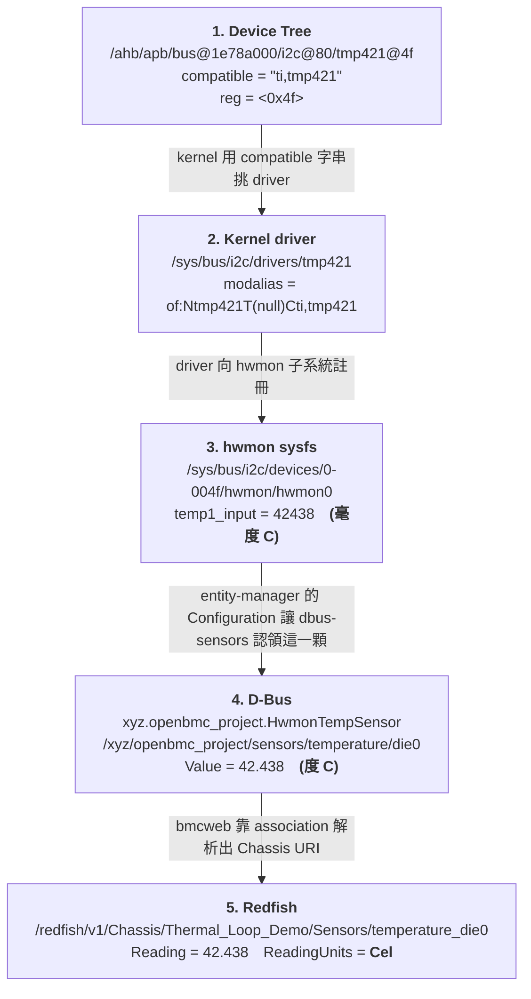

# 一顆感測器:從 Device Tree 到 Redfish

| | |
|---|---|
| 日期 | 2026-08-09 |
| 平台 | `bletchley`(QEMU machine `bletchley-bmc`) |
| 映像 | `obmc-phosphor-image-bletchley-20260728025045.static.mtd` |
| 追的是哪一顆 | `die0` —— i2c bus 0、位址 `0x4f` 的一顆 **TMP421** |
| 怎麼取得 device tree | `scp root@bmc:/sys/firmware/fdt` → `dtc -I dtb -O dts` |
| 重跑指令 | `./tools/trace_sensor.sh` → `python bench/plot_fig6.py` |
| 原始證據 | `bench/data/exp03_trace/raw/`(每一格都指得回一條指令的 stdout) |
| 圖 | `figures/fig6_dts_to_redfish.png`(**Fig 6**) |

> **為什麼 device tree 取 `/sys/firmware/fdt`,不是映像裡的 `.dtb`**
> `/sys/firmware/fdt` 是 **kernel 實際載入的那一份**,包含 bootloader 可能做過的修改
> (記憶體大小、MAC 位址、`chosen/bootargs`…)。映像裡的 `.dtb` 是「應該載入的」。
> 兩者通常一樣,但「通常」不是證據。
>
> 附帶一提:這個映像**沒有 `dtc`**,所以做法是把 blob 抓回開發機再反編譯,
> blob 本身(`bench/data/exp03_trace/live.dtb`)也進了 repo。

---

## 0. 一張圖



同樣的內容有一張畫出來的版本:`figures/fig6_dts_to_redfish.png`。
兩者的每一格都是同一次擷取(`bench/data/exp03_trace/layers.json`)產生的。

---

## 1. Device Tree

```dts
i2c@80 {
        reg = <0x80 0x80>;
        compatible = "aspeed,ast2600-i2c-bus";
        bus-frequency = <0x186a0>;
        status = "okay";
        /* ... 2 more device nodes on this bus, elided ... */
        tmp421@4f {
                compatible = "ti,tmp421";
                reg = <0x4f>;
        };
};
```

證據:`raw/11_dts_snippet.txt`、`raw/10_dts_node.txt`

要讀懂的五件事(只有這五件):

| dts 元素 | 意義 | 決定了什麼 |
|---|---|---|
| `i2c@80`(別名 `i2c0`) | SoC 的第 0 條 I2C 控制器,暫存器偏移 `0x80` | **bus 編號** → sysfs 會是 `0-00xx` |
| `status = "okay"` | 啟用這條 bus(SoC 的 `.dtsi` 裡預設常是 `disabled`) | 沒這行,這條 bus 根本不會被 probe |
| `tmp421@4f` | 節點名 ＋ **unit address** | 慣例上要與 `reg` 一致 |
| **`compatible = "ti,tmp421"`** | **kernel 依此綁定 driver** | **`drivers/hwmon/tmp421.c`** |
| `reg = <0x4f>` | **I2C 從機位址** | sysfs 路徑 `0-004f` |

> **這五行裡最重要的是 `compatible`。** 它是 device tree 與 driver 之間的**唯一契約**。

`aliases` 那一段是驗證 bus 編號的地方(不要用數的):

```
i2c0 = "/ahb/apb/bus@1e78a000/i2c@80";
```

---

## 2. Kernel 綁定

```
$ D=/sys/bus/i2c/devices/0-004f
name     = tmp421
driver   = /sys/bus/i2c/drivers/tmp421
modalias = of:Ntmp421T(null)Cti,tmp421
```

證據:`raw/20_binding.txt`

**`modalias` 這一行就是「它是從 device tree 綁上來的」的證據。**
`of:` 開頭代表 Open Firmware(= device tree)比對;`N` 後面是節點名、`C` 後面是
`compatible` 字串。如果這顆是**執行時期**用 `new_device` 建出來的(entity-manager
對可熱插拔的 FRU 就是這樣做),`modalias` 會是 `i2c:tmp421`,而且 `of_node` 不存在。

> **我原本以為是後者。** 本專案 W3 用 entity-manager 設定了這顆 TMP421,
> 所以我一開始假設「裝置是 entity-manager 建的」。實際去看 `of_node` 才發現
> **裝置本來就在 dts 裡,entity-manager 做的是另一件事**(見第 4 節)。
> 這個誤會如果沒查,Fig 6 的第一格就是編的。

---

## 3. sysfs / hwmon

```
$ H=$(ls -d /sys/bus/i2c/devices/0-004f/hwmon/hwmon* | head -n 1)
path         = /sys/bus/i2c/devices/0-004f/hwmon/hwmon0
name         = tmp421
temp1_input  = 42438
```

證據:`raw/30_hwmon.txt`

★ **單位是毫度 C。** 這是第一次換單位。

擷取當下注入的是 **42.5 °C**,晶片回報 **42.438 °C**。

> ⚠️ **2026-08-09 更正:這裡原本寫「差的 0.0625 °C 就是一個量化階」。那句話是錯的。**
> `42.5` 剛好落在 1/16 的格點上(42.5 = 680/16),**純量化器應該原封不動回 42.5**。
> 那一格的差是 QEMU setter `(temp*256-128)/1000` 的截斷造成的**系統性偏壓** ——
> 注入路徑上每一個落在格點的值都低整整一格,實測 35 個觀測零例外。
> 量化與偏壓是**兩件事**,完整推導與實驗見
> [`plant-model.md` §2.1](plant-model.md) 與 `bench/data/exp04_injection/`。
>
> **這個更正對這張圖沒有影響** —— 圖上的 `42438` 仍然是這台機器真實的 hwmon 讀值。
> 變的是「為什麼是這個值」的解釋。

---

## 4. entity-manager —— 計畫沒畫、但少了它整條路就斷掉的那一層

計畫的五層圖裡沒有這一格。實際上 hwmon 與 D-Bus 之間有一道閘門:

```
$ busctl tree xyz.openbmc_project.EntityManager
  └─ /xyz/openbmc_project/inventory/system/board/Thermal_Loop_Demo
    └─ /xyz/openbmc_project/inventory/system/board/Thermal_Loop_Demo/die0
```

證據:`raw/40_em.txt`、`raw/43_em_all_configs.txt`

**一顆 `dbus-sensors` 感測器要出現在 D-Bus 上,需要兩個條件同時成立:**

| | 硬體在(kernel 綁得起來) | 硬體不在 |
|---|---|---|
| **有 EM Configuration** | ✅ **`die0` —— 出現** | ❌ **`FRONT_PANEL_TEMP` —— 不出現** |
| **沒有 EM Configuration** | ❌ **另外 9 顆 tmp421 —— 不出現** | (不適用) |

這三格**都在同一台機器上量得到**:

- **有硬體沒設定:** 這份 dts 宣告了 **10 顆** `tmp421`,kernel 全部綁上了
  (`/sys/class/hwmon/*/name` 裡有 **10** 個 `tmp421`),但 `dbus-sensors` 只認領了
  `die0` 這一顆 —— 因為只有它有 entity-manager 的 Configuration。
  證據:`raw/45_dts_tmp421_count.txt`(10)、`raw/42_counts.txt`
- **有設定沒硬體:** `FRONT_PANEL_TEMP` 是這個映像自帶的 EM 設定,
  型別 `SI7020`、bus 10、位址 `0x40`(十進位 64)。但 QEMU 的 `bletchley-bmc`
  沒有模擬那顆晶片 —— `/sys/bus/i2c/devices/10-0040` 不存在,所以它也沒出現。
  證據:`raw/44_config_without_hardware.txt`

### ⚠️ 4.1 但上面那張表**只管 `dbus-sensors` 那一族**,不是 D-Bus 感測器的普遍條件

> **2026-08-09 更正。** 這一節原本寫的是「一顆感測器要出現在 D-Bus 上,
> 需要兩個條件同時成立」—— 沒有限定範圍。
> **那句話用這台機器自己的資料就能戳破**,而且 README 的 Gate 1 段落
> 前面才剛提到那些反例。

**實測(同一次擷取,`busctl ... GetObject` 逐顆問擁有者):**

| 感測器 | D-Bus 擁有者 | 設定從哪來 | 有 EM Configuration? |
|---|---|---|:--:|
| `die0` | `xyz.openbmc_project.HwmonTempSensor` | entity-manager | ✅ |
| `nvme1`~`nvme6` | **`xyz.openbmc_project.nvme.manager`** | **`/etc/nvme/nvme_config.json`** | ❌ |
| `Virtual_Inlet_Temp` | **`xyz.openbmc_project.VirtualSensor`** | **`/usr/share/phosphor-virtual-sensor/virtual_sensor_config_*.json`** | ❌ |

**用 repo 自己 commit 的資料就對得出來:**
`raw/42_counts.txt` 寫 `dbus_temperature_sensors=8`,
`raw/43_em_all_configs.txt` 只有 **2** 個 Configuration 物件。**8 ≠ 2。**

**正確的說法是:**

> **entity-manager 的 Configuration 是 `dbus-sensors` 那一族的閘門**,
> 不是「上 D-Bus」的普遍條件。這台機器上至少還有兩條獨立的路徑
> —— `phosphor-nvme` 與 `phosphor-virtual-sensor` —— **各自有自己的設定機制**。

> **面試講法(改完之後反而更值錢):**
> 「一顆感測器上 D-Bus 有好幾條路。`dbus-sensors` 那條要 entity-manager 的
> Configuration;`phosphor-nvme` 走自己的 `/etc/nvme/nvme_config.json`;
> 虛擬感測器又是另一套 JSON。**所以 debug 的第一步不是去翻 EM 設定,
> 是先問這顆是從哪一條路上來的** ——
> `busctl call ... GetObject` 兩秒就知道擁有者是誰,
> 知道擁有者才知道該去看哪一份設定檔。」
>
> 「而**在 `dbus-sensors` 那一條路裡面**,『硬體在』與『設定在』才是兩個獨立的
> 必要條件 —— 我在同一台機器上同時觀察到兩種失敗,看
> `/sys/bus/i2c/devices/` 有沒有那個節點,兩秒就分得出來是哪一種。」

---

## 5. D-Bus

```
service      = xyz.openbmc_project.HwmonTempSensor
object       = /xyz/openbmc_project/sensors/temperature/die0
Value        = 42.438
Unit         = xyz.openbmc_project.Sensor.Value.Unit.DegreesC
Associations = a(sss) 1 "chassis" "all_sensors"
                        "/xyz/openbmc_project/inventory/system/board/Thermal_Loop_Demo"
```

證據:`raw/50_dbus_owner.txt`、`raw/51_dbus_value.txt`、`raw/52_dbus_unit.txt`、`raw/53_dbus_assoc.txt`

★ **單位換成度 C。** 這是第二次換單位(毫度 → 度)。

`Associations` 是**感測器與 Chassis 之間的唯一契約**。沒有這組
`chassis` / `all_sensors` association,感測器在 D-Bus 上活得好好的,
但 Redfish 上完全看不到它(這正是 runbook §5.16「三段分割法」的第三段)。

---

## 6. Redfish

```json
{
  "@odata.id": "/redfish/v1/Chassis/Thermal_Loop_Demo/Sensors/temperature_die0",
  "Id": "temperature_die0",
  "Name": "die0",
  "Reading": 42.438,
  "ReadingType": "Temperature",
  "ReadingUnits": "Cel",
  "Status": { "Health": "OK", "State": "Enabled" }
}
```

證據:`raw/60_redfish_collection.txt`、`raw/61_redfish_sensor.txt`

★ **單位字串換成 `Cel`。** 這是第三次換寫法(同一個單位,不同的表示法)。

★ **id 是 `temperature_die0`,不是 `die0`。** bmcweb 用 `<型別>_<名字>` 當 id,
腳本不可以寫死,要從 collection 讀回來。

---

## 7. 我從這條追蹤學到什麼

1. **單位換了三次**:`42438`(毫度 C)→ `42.438`(度 C)→ `Cel`。
   每一次換都是一個潛在的 bug 位置。W3 已經踩過一次
   ——`ignoreDbusMinMax` 沒設,PID 拿到正規化後的 `0.8154` 去跟 setpoint `65` 相減,
   **而且完全不報錯**。
2. **名字換了四次**:`tmp421@4f` → `0-004f` → `hwmon0` → `die0` → `temperature_die0`。
   沒有任何一層看得到下一層的名字,**每一層的對應關係都是另外一份設定決定的**。
3. **`compatible` 是 dts 與 driver 之間的唯一契約。**
4. **association 是感測器與 Chassis 之間的唯一契約。**
5. **entity-manager 的 Configuration 是 hwmon 與 D-Bus 之間的契約 ——
   但只在 `dbus-sensors` 這一條路上。** 它與硬體是兩個獨立的必要條件
   (第 4 節的表),而**同一台機器上還有兩條完全不經過它的路**(§4.1)。
6. 所以 **BMC 團隊 debug 一顆感測器要跨這麼多層,不是因為架構複雜,
   是因為每一層之間都靠一份「對應關係」黏著,而問題可能出在任何一份上。**
7. ★ **而且「是哪一份」要先問「這顆是誰在 own」** —— 不同的 daemon 讀不同的設定檔。
   先查擁有者再查設定,順序反了會在錯的檔案裡找很久。

---

## 8. 這一節的邊界(誠實準則)

- 這是「**讀 ＋ 對照**」。**我沒有寫過 kernel driver,也沒有改過 device tree
  並重新編譯驗證。**
- 硬體是 **QEMU 模擬的**。`tmp421` 這顆晶片在 QEMU 裡有行為模型
  (`hw/sensor/tmp421.c`),溫度是我從 QMP 用 `qom-set` 寫進去的。
  **從 i2c driver 往上全部是真的軟體**,但底下那顆晶片不是實體的。
- 這張圖證明的是「**這條軟體路徑在這台機器上是通的,而且每一格我都量過**」,
  不是「我做過硬體 bring-up」。
